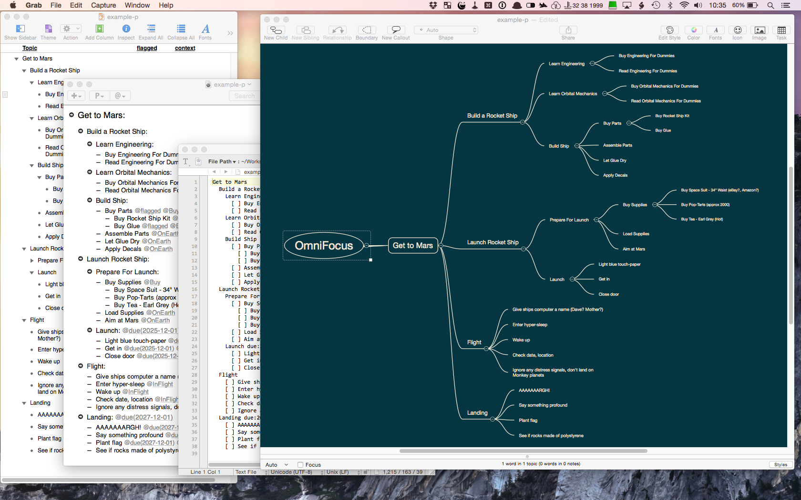

[Home](README.md) | [Release Notes](RELEASE-NOTES.md) | [Support](SUPPORT.md) | [Documentation](DOCUMENTATION.md)

# ofexport2

Export from OmniFocus to various other formats:

- [Licence: Apache License Version 2.0](LICENSE)
- [Blog: Poor Signal](http://poor-signal.blogspot.co.uk)
- [Twitter: @psidnell](http://twitter.com/psidnell)

## Table Of Contents

- [ofexport2](README.md#ofexport2)
- [Release Notes](RELEASE-NOTES.md#release-notes)
- [Support](SUPPORT.md#support)
- [Documentation](DOCUMENTATION.md#documentation)
    - [Overview](DOCUMENTATION.md#overview)
    - [Audience](DOCUMENTATION.md#audience)
    - [How it works](DOCUMENTATION.md#how-it-works)
    - [Installation](DOCUMENTATION.md#installation)
    - [Uninstallation](DOCUMENTATION.md#uninstallation)
    - [Usage](DOCUMENTATION.md#usage)
        - [Usage Overview](DOCUMENTATION.md#usage-overview)
        - [Filtering](DOCUMENTATION.md#filtering)
            - [Project vs Context Mode](DOCUMENTATION.md#project-vs-context-mode)
            - [Filtering by Text](DOCUMENTATION.md#filtering-by-text)
            - [Include or Exclude](DOCUMENTATION.md#include-or-exclude)
            - [Cascading](DOCUMENTATION.md#cascading)
            - [Filtering by Date](DOCUMENTATION.md#filtering-by-date)
            - [Useful Filtering Attributes](DOCUMENTATION.md#useful-filtering-attributes)
        - [Output and Formats](DOCUMENTATION.md#output-and-formats)
        - [Sorting](DOCUMENTATION.md#sorting)
        - [Pruning](DOCUMENTATION.md#pruning)
        - [Simplifying](DOCUMENTATION.md#simplifying)
        - [Flattening](DOCUMENTATION.md#flattening)
        - [Inbox and No Context](DOCUMENTATION.md#inbox-and-no-context)
        - [Command Line Options](DOCUMENTATION.md#command-line-options)
        - [Full Attribute List](DOCUMENTATION.md#full-attribute-list)
        - [Configuration](DOCUMENTATION.md#configuration)
        - [Tips](DOCUMENTATION.md#tips)
            - [Include Projects with Tags](DOCUMENTATION.md#include-projects-with-tags)
            - [Save Useful Commands as Scripts](DOCUMENTATION.md#save-useful-commands-as-scripts)
            - [Solving Problems](DOCUMENTATION.md#solving-problems)
            - [Modifying Node Values](DOCUMENTATION.md#modifying-node-values)
    - [Writing a Template](DOCUMENTATION.md#writing-a-template)
    - [Building It Yourself](DOCUMENTATION.md#building-it-yourself)
    - [ofexport vs ofexport2](DOCUMENTATION.md#ofexport-vs-ofexport2)
    - [Other Approaches Considered](DOCUMENTATION.md#other-approaches-considered)
    - [Known Issues](DOCUMENTATION.md#known-issues)

