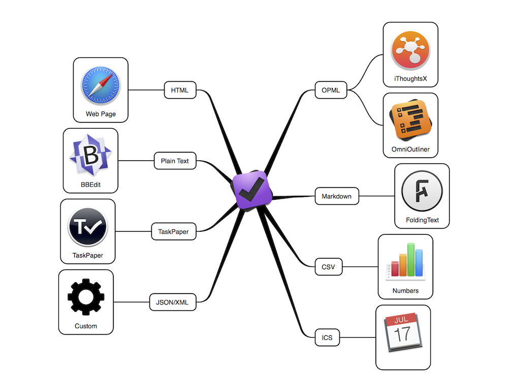

# OFEXPORT2

*Updated 2014-12-09.*

[Release Notes](doc/RELEASE-NOTES.md)

Export from OmniFocus to various other formats:

Jump To:

- [Latest Stable Release: 1.0.11](https://github.com/psidnell/ofexport2/blob/ofexport-v2-1.0.11/README.md)
- [Development Version](https://github.com/psidnell/ofexport2/blob/master/README.md)

Support:

- [Bugs](https://github.com/psidnell/ofexport2/issues)
- [Blog: Poor Signal](http://poor-signal.blogspot.co.uk)
- [Twitter: @psidnell](http://twitter.com/psidnell)

----

## Table of Contents

- [Introduction](#introduction)
- [Audience](#audience)
- [How it works](#how-it-works)
- [Installation](#installation)
- [Uninstallation](#uninstallation)
- [Usage](#usage)
    - [Overview](#overview)
    - [Filtering](#filtering)
        - [Project vs Context Mode](#project-vs-context-mode)
        - [Filtering by Text](#filtering-by-text) 
        - [Include or Exclude](#include-or-exclude)
        - [Cascading](#cascading)
        - [Filtering by Date](#filtering-by-date)
        - [Useful Filtering Attributes](#useful-filtering-attributes)
    - [Output and Formats](#output-and-formats)
    - [Sorting](#sorting)
    - [Pruning](#pruning)
    - [Flattening](#flattening) 
    - [Inbox and No Context](#inbox-and-no-context)
    - [Command Line Options](#command-line-options)
    - [Full Attribute List](#full-attribute-list)
  - [Configuration](#configuration)
  - [Tips](#tips)
  - [Writing a Template](#writing-a-template)
  - [Building it Yourself](#building-it-yourself)
- [ofexport vs ofexport2](#ofexport-vs-ofexport2)
- [Other Approaches Considered](#other-approaches-considered)
- [Known Issues](#known-issues)

## Introduction

**ofexport2** is a command line tool for exporting OmniFocus data to a variety of file formats and is a complete re-write of the original [ofexport](https://github.com/psidnell/ofexport/blob/master/DOCUMENTATION.md).

## Audience ##

To be able to use ofexport2 there are some pre-requisites, you need to:

- Have [OmniFocus](https://www.omnigroup.com/omnifocus) installed.
- Be comfortable using bash and the command line.
- Know what an [expression](http://en.wikipedia.org/wiki/Expression_(computer_science)) is.
- Have [Java 8](https://www.oracle.com/java/index.html) or know how to install it.
- Have read and appreciated [The Hitchhikers Guide to the Galaxy](http://en.wikipedia.org/wiki/The_Hitchhiker's_Guide_to_the_Galaxy).

You're going to have to know [where your towel is](http://hitchhikers.wikia.com/wiki/Towel).

## How it works

1. The tool reads the entire OmniFocus SQLite database.
2. Various command line filters are applied to eliminate unwanted data, sort items, etc.
3. The remaining data is printed to the console or saved to a file in some specific format.

Currently supported export formats are:

1. Plain Text
2. Markdown
3. TaskPaper
4. HTML
5. CSV
6. OPML
7. XML
8. JSON

The key technologies used for the transformation are:

1. [Java 8](https://java.com/en/download/index.jsp) for the main command line program.
2. [OGNL](http://commons.apache.org/proper/commons-ognl/) for specifying filters and sorting.
3. [FreeMarker](http://http://freemarker.org) for the templates to provide the output.

## Installation ##

Installation is entirely manual and done from the command line. Essentially you will be downloading/unpacking the zip and adding it's bin directory to your path.

### 1. You should have Java 8 already installed.

You can verify this by typing:

    java -version

You should see output similar to:

    java version "1.8.0_25"  
    Java(TM) SE Runtime Environment (build 1.8.0_25-b17)  
    Java HotSpot(TM) 64-Bit Server VM (build 25.25-b02, mixed mode)  

### 2. Download:

To get the required files, either:

- Download the latest stable version: [ofexport-v2-1.0.11.zip](https://github.com/psidnell/ofexport2/archive/ofexport-v2-1.0.11.zip)
- Download the current development version: [master.zip](https://github.com/psidnell/ofexport2/archive/master.zip)
- Check out this git repository so you can take updates as you wish with git.

If you downloaded a zip, unzip it and move/rename the root folder as you wish.

For now I'm going to assume you moved and renamed it to **~/Applications/ofexport2**.

### 3. Set Execute Permission on the ofexport2 Shell Script ###

On the command line type:

    chmod +x ~/Applications/ofexport2/bin/ofexport2

Make sure it's working by running:

    ~/Applications/ofexport2/bin/ofexport2 -h

It should print it's command line options.

### 4. Add ofexport2 to your path

Create/Edit your **~/.bash_profile** and **add** the following lines:

    export PATH=$PATH:~/Applications/ofexport2/bin
    alias of2=ofexport2

The second line above isn't necessary but creates a convenient alias for the program and makes the examples in this document more concise.

When done reload your environment by typing:

    . ~/.bash_profile

Finally verify everything has worked by typing **ofexport2** (or **of2**) and ensuring it prints it's command line options.

## Uninstallation ###

Simply delete the ofexport2 folder and remove the lines you added to your .bash_profile.

## Usage ##

### Overview ###

To see the [full list of options](doc/Options.md), type:

    of2 -h

Basic usage of the tool is fairly straight-forward. If you're familiar with OmniFocus you can probably guess what these commands will show:

    of2 -ti all
    of2 -ti available
    of2 -ti remaining
    of2 -ti flagged
    of2 -ti completed

The above will show tasks with the selected attributes (**filtering**) in their project hierarchy. To see them in their context hierarchy add the "-c" option, e.g.

    of2 -c -ti available

These attributes you select on can be combined by chaining filters:

    of2 -c -ti remaining -ti due.soon

Or by creating filters with [OGNL](http://commons.apache.org/proper/commons-ognl/) expressions.

    of2 -c -ti 'remaining && due.soon'

It's possible to isolate specific Folders, Projects etc. For example to print the contents of a named project (In this case I have a project called ofexport2):

    of2 -pn 'ofexport2'

This outputs the following:

    Home
      ofexport2
        [ ] Create "installer"
          [ ] Print version in help
          [X] Add license, docs etc.
          [X] Create "release process"
          [X] Generate README.md from template
          [ ] maven site generation
        [X] Filters - finish - test
        [ ] Code Quality
          [ ] Coverage
          [X] Address TODOs
          [ ] Timing and stats
          [ ] Add logging
          [X] basic Javadoc
          [X] Only integration tests should use real database
          [X] format code

The default output format is a simple text list where uncompleted tasks are prefixed with a [ ] and completed tasks are prefixed with a [X]. Items are indented to indicate the original OmniFocus hierarchy.

### Filtering ###

Advanced queries can be assembled with filters:

- Filters are expressions used to limit what Folders, Projects, Tasks or Contexts appear in the output.
- Filters can be applied to specific note types (Folders, Projects etc.)
- Filters can be simple like a text search.
- Filters can be complex expressions that make use of various attributes of an item.
- Filters can either include items of interest or exclude unwanted items.
- Filters can select a just a node, or a node and all those beneath it.
- Any number of filters can be used.
- Filters are executed in order, each filter is run on the results of the last, thus filters can only reduce what appears in the output.

#### Project vs Context Mode ####

Normally ofexport2 is in project mode, i.e. the project hierachy is used for filterng and output:

    of2 -ti available

By using the "-c" option, the tool operates in context mode:

    of2 -c -ti available

It's an error to try and use a project filter in context mode and vice versa.

#### Filtering by Text

To search for an items with a specific exact names:

    of2 -fn "My Folder"
    of2 -pn "My Project"
    of2 -tn "My Task"
    of2 -c -cn "My Context"
    of2 -an "Anything Called This"

These name filters are actually a convienient shorthand for an expression that uses the name attribute of items, for example:

    of2 -fc 'name=="My Folder"'

By using the attribute in your own expressions, much more sophisticated filters can be used.

To search for a task that contains text:

    of2 -tc 'name.contains("X")'
    of2 -tc 'name.equalsIgnoreCase("X")'
    of2 -tc 'name.equalsIgnoreCase("ofexpoRt2")'
    of2 -tc 'name.toLowerCase().contains("x")'

(The functions (methods) available in these expressions are from the [Java String class](https://docs.oracle.com/javase/8/docs/api/java/lang/String.html)).
    
To use regular expressions:

    of2 -tc 'name.matches(".*X.*")'
    
These expressions can be fairly complex:

    of2 -tc 'name.matches(".*(Call|Phone).*") && name.contains("Dave")'

It's also possible to access the text of a note or project in filters:

    of2 -ti 'note!=null && note.contains("x")'

(That the **note!=null** check is necessary here because (unlike name) the note may be absent and there would be a Java error applying the **contains** method to the missing value.)

#### Include or Exclude

The difference between include and exclude filters is:

- **include**: if the expression matches a node then it then it's included, otherwsise it's eliminated.
- **exclude**: if the expression matches a node then it and it's descendents are eliminated.
- These filters are applied only to a specifc item type, others are ignored.

To illustrate the difference for a folder:

    of2 -fc 'name="MyFolder"'
    of2 -fx 'name="MyFolder"'

The first shows "MyFolder", the second shows everything except "MyFolder".

#### Cascading

Include filters come in two flavours, cascading and non cascading.

- **cascading**: include the item and everything beneath it.
- **non-cascading**: include just the item.

For example:

    of2 -fn "My Folder"
    of2 -fc 'name=="My Folder"'
    of2 -fi 'name=="My Folder"'

The first two are cascading and equivalent, they show matching folders and everything within them.

The third shows only the matching folders and nothing beneath them.

#### Filtering by Date ####

Tasks and Projects have several dates:

- completion
- defer
- due

There are various ways to match on dates and dateRanges:

    of2 -ti 'completion.is("today")'
    of2 -ti 'completion.between("5th","today")'
    of2 -ti '!completed && defer.is("today")'
    of2 -ti '!completed && due.after("2015-01-01")'
    of2 -ti '!completed && due.onOrAfter("2015-01-01")'
    of2 -ti '!completed && due.before("2015-01-01")'
    of2 -ti '!completed && due.onOrBefore("2015-01-01")'
    of2 -ti '!completed && due.soon'

Some of the above filters also include a check that the item is not completed (**!completed**). This is because completed items retain their defer and due dates. Typically when we want to know what's due or starting we're not interested in what we've already done. However if you did want to see them just remove the check.

Note that when using '**.soon**', the value is set in the dueSoon configuration variable see [Configuration](#configuration). This can be applied to any of the dates but clearly makes no sense for the completed attribute!.

The strings formats of dates that are accepted in these filters are:

- **"yesterday"**,**"today"**,**"tomorrow"**
- **"2014-11-19"**: specific date (yyyy-mm-dd).
- **"Mon"**, **"mon"**, **"Monday"**, **"monday"**: the monday of this week (weeks start on Monday).
- **"-mon"**: the monday of last week.
- **"+mon"**: the monday of next week.
- **"Jan"**,**"jan"**,**"January"**,**"january"**: the 1st of January of this year.
- **"-Jan"**,**"-jan"**,**"-January"**,**"-january"**: the 1st of January last year.
- **"+Jan"**,**"+jan"**,**"+January"**,**"+january"**: the 1st of January next year.
- **"1d"**,"**+1day"**,**"-2days"**: days in the future/past.
- **"1w"**,"**+1week"**,**"-2weeks"**: weeks in the future/past.
- **"1m"**,"**+1month"**,**"-2months"**: months in the future/past.
- **"1y"**,"**+1year"**,**"-2years"**: months in the future/past.
- **"1st"**,"**2nd"**,**"23rd"**: day of this month.

#### Useful Filtering Attributes ####

Filtering **Tasks/Projects** on **status**:

    of2 -ti flagged
    of2 -ti unflagged
    of2 -ti '!flagged
    of2 -tx flagged
    of2 -pi flagged
    of2 -pi unflagged
    of2 -pc flagged

Filtering **Tasks/Projects** on **availability**:

    of2 -ti all
    of2 -ti available
    of2 -ti remaining
    of2 -ti completed
    of2 -pi remaining
    of2 -pc available

Filtering **Tasks/Projects** on **duration**:

    of2 -ti 'estimatedMinutes > 20'
    of2 -ti 'estimatedMinutes==-1' (unestimated)
    of2 -pi 'estimatedMinutes > 5 && estimatedMinutes < 10'

Filtering **Projects** on their **status**:

    of2 -pi active
    of2 -pc onHold
    of2 -px completed
    of2 -pi dropped

*Note: stalled and pending are not yet supported*

Filtering items by their **text**/**note**:

    of2 -c -cn 'exact name of context'
    of2 -pc 'name.contains("text in folder name")'
    of2 -fc 'name.matches(".*regularExpressionOnFolderName.*")'
    of2 -ti 'note!=null && note.contains("stuff")'

Filtering **Tasks**/**Projects** by **dates**:

    of2 -ti 'completion.is("today")'
    of2 -ti 'completion.between("5th","today")'
    of2 -ti '!completed && defer.is("today")'
    of2 -ti '!completed && due.after("2015-01-01")'
    of2 -ti '!completed && due.onOrAfter("2015-01-01")'
    of2 -ti '!completed && due.before("2015-01-01")'
    of2 -ti '!completed && due.onOrBefore("2015-01-01")'
    of2 -ti '!completed && due.soon'

Filtering **Folders** by **status**:

     of2 -fi active
     of2 -fx dropped

Filtering **Contexts** by **status**:

    of2 -c -ci active
    of2 -c -cc onHold
    of2 -c -cx dropped

Useful Combinations:

    of2 -ti 'available && defer.is("today")'
    of2 -ti 'available && (due.soon || flagged)'
    of2 -ti 'completion.between("mon","today")'

What I do to generate weekly reports. I want a flattened list of work tasks completed this week:

    of2 -fn 'Work' -px 'name.contains("Routine")' -ti 'completion.between("mon","today")' -p -F -f report -O ~/Desktop/Report.taskpaper

### Output and Formats ###

Output can be written to a file by using the "-o" option, e.g.

    of2 -pn "My Project" -o myproj.md
    
The output will be automatically be in "Markdown" format because the file suffix is "md".

The supported suffixes are:

- md: Markdown format.
- taskpaper: TaskPaper format.
- report: A specific TaskPaper format I use for generating reports.
- txt: Text format
- opml: OPML format.
- csv: CSV format.
- html: HTML format.
- debug: A text format that contains all attributes of nodes.

If you want to specify a format different from the one derived from the output file (or are printing to the console) you can override it:

    of2 -pn "My Project" -f md"
    of2 -pn "My Project" -f report -o myproj.taskpaper

The format name being applied is used to find a FreeMarker template file in **config/templates**.

It's possible to modify these or add your own.

### Sorting ###

The natural sort order of items is based on their position in OmniFocus. It's possible to specify
any attribute as the one to use for an item type:

    of2 -ti available -ts name
    of2 -ti available -ts r:name

The above sorts tasks by their name, with the second being a reverse sort.

It's possible to have chain the sorts much like filters:

    of2 -ts completion -ts name

This sorts items by their completion date, and for those with the same date it then sorts by name.

Note that items are sorted at a particular level. If a task has subtasks then the subtasks will be sorted but they will stay in their position beneath their parent task (see [Flattening](#flattening)).

It's possible to sort by any attribute, including flagged status. The following displays flagged irems above unflagged ones, and within that sorts by due:

    of2 -ti 'remaining && due.soon' -ts r:flagged -ts due

### Pruning ###

Sometimes the output is cluttered with empty Contexts, Folders or Projects that you want to keep in OmniFocus but not see in the output.

Using the **-p** option eliminates them.

### Flattening ###

Sometimes what is a useful Folder/Context hierarchy in OmniFocus ends up making reports look cluttered.

The **-F** option flattens nested the hierarchy to just Folder/Projects/Contexts and lifts sub tasks up to the level of their parent.

All projects and contexts are moved to the root level, and sub tasks moved up to the level of their parent.

This can make sorting more useful, compare the following:

    of2 -ti 'remaining && due.soon' -ts r:flagged -ts due
    of2 -ti 'remaining && due.soon' -ts r:flagged -ts due -F

### Inbox and No Context

OmniFocus has special pseudo items **Inbox** and **No Context**. The ofexport2 tool displays both of these as if they were a normal Project and Context so they can be used in filters and templates.

### Command Line Options

The full options list be displayed by typing:

    of2 -h

or [here](doc/Options.md).

### Full Attribute List

The full list of attributes that can be used in expressions or filters can be displayed by typing:

    of2 -i

or [here](doc/Attributes.md).

## Configuration ##

Configuration files you might need to modify are:

    /config/templates/... - FreeMarker templates.
    /config/config.properties - Config values for the application and templates.
    /config/config.xml - contains the possible locations for the OmniFocus database.

It's possible to override values in config.properties from the command line, for example reducing the dueSoon time to 2 days:

    of2 -D 'dueSoon=2d' -ti dueSoon

### Tips ###

#### Include Projects with Tags ####

Generate a report containing projects whose note contains "#report#".

    of2 -pi 'note!=null && note.contains("#report")'

#### Save Useful Commands as Scripts ####

Keep regularly used commands as scripts to save time.

Here's one of my base scripts as an example.

    #!/bin/bash
    
    FOLDER="$1"
    WHEN="$2"
    
    FILE="$HOME/Desktop/REPORT-$FOLDER-`date +"%Y-W%V-%h-%d"`.taskpaper"
    
    ofexport2 \
     -ac "(type==\"Folder\" && name.matches(\"$FOLDER|Anywhere\")) || (type==\"Project\" && name==\"Inbox\")" \
     -fx 'name.contains("Routine Maint")' \
     -F \
     -ti "completion.onOrAfter(\"$WHEN\")" \
     -p \
     -f report \
     -O "$FILE"

#### Solving Problems

- Add filters one at time until you get the required output.
- Use the **-f debug** to use the debug format that lists all attributes of an item.

## Writing a Template ##

- The templates are written in [FreeMarker](http://freemarker.org) syntax.
- The templates live in **config/templates**.
- Using the options "-f xxx" or "-o file.xxx" will cause ofexport to look for a template ***config/templates/xxx.ftl***.
- The object model available in the templates can be printed using **of2 -i**.

Copying and experimenting on an existing template is the best way to start.

## Building It Yourself ##

The build is a straight forward java [maven 3](http://maven.apache.org) build.

After installing maven, cd into the ofexport folder and run:

    mvn clean package 

The build folder contains two utility scripts:

- **pre-release.sh** recreates several files with versions/dates updated.
- **release.sh** runs the maven release goals.

Before releasing can succeed you will need to update the pom file with your own:

- developerConnection
- distributionManagement/repository/url

## ofexport vs ofexport2

The original ofexport was written in python since python comes supplied with
OS X.

However, this version is written in Java. While this is inconvenient in that it
requires installing java, it does provide access to a lot of useful technologies
such as FreeMarker, OGNL and Jackson. I also write better Java than Python.

## Other Approaches Considered

I originally wanted to access the OmniFocus data using AppleScript (or JavaScript
on Yosemite) and did actually get as far as a working prototype that serialised
JSON data from the osascript command back to the controlling program. While it was
in the end quite simple to do it was unbelievably slow, taking sometimes minutes for
a large export rather than about a second when accessing the database directly. While this approach would have been officialy suppotable by Omni it was unfotunately impractical. 

## Known Issues ##

- Task/Project notes are stripped back to ASCII on export because wide characters seem corrupted when I retrieve them. This could be down to the encoding OmniFocus uses or it could be an issue with the SQLite Java driver. I experimented with various obvious specific encodings but that didn't help.
- Perspective data is something I haven't managed to decode.
- In  OmniFocus, child Contexts/Tasks are interleaved, as are child Projects/Folders. In ofexport they are not.
